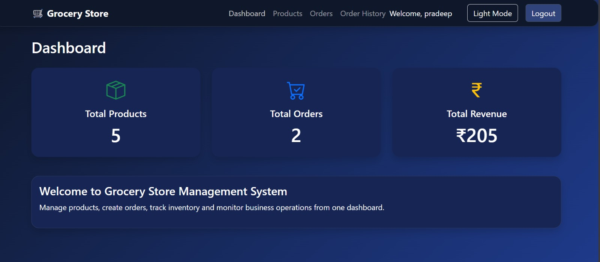
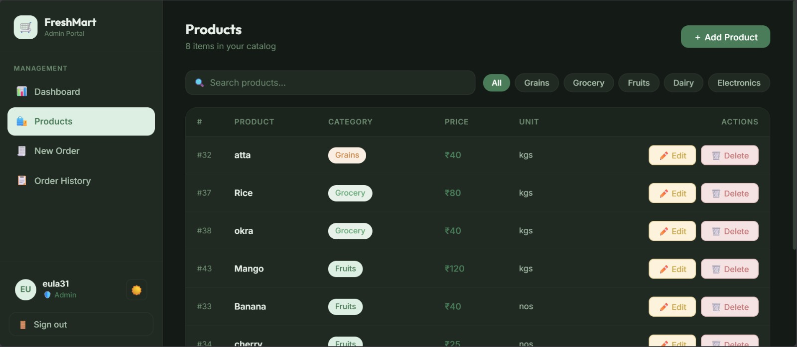
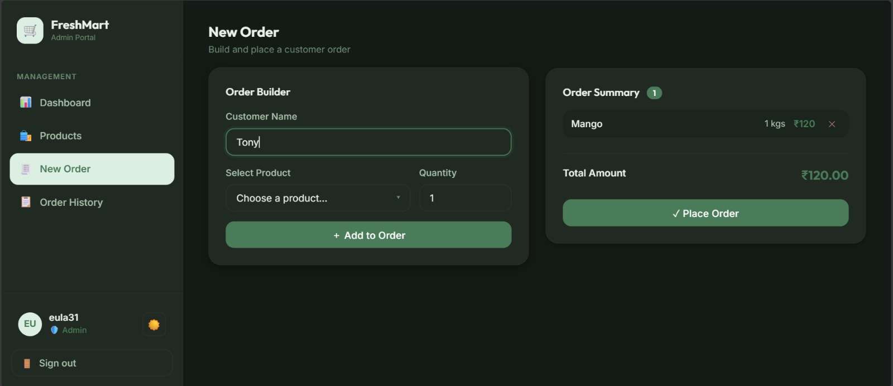
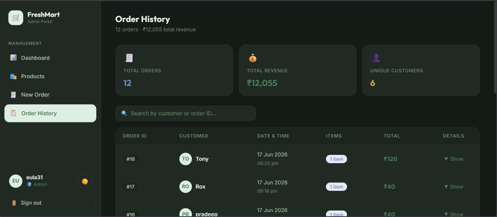

<<<<<<< HEAD
# 🛒 Grocery Store Management System

A full-stack Grocery Store Management System built using **React.js**, **Flask**, and **MySQL**. This application helps manage products, create customer orders, track order history, and monitor business performance through an interactive dashboard.

---

## 🚀 Features

### 📊 Dashboard
- View total products
- View total orders
- View total revenue
- Quick business overview



---

### 📦 Product Management
- Add new products(By Admin)
- View all products
- Search products instantly
- Product categories and units support



---

### 🛍️ Order Management
- Create orders for any customer
- Select products and quantity
- Automatic order total calculation
- Multiple products per order



---

### 📜 Order History
- View all previous orders
- Customer-wise order tracking
- Order date and total amount



---

### 🔐 Authentication
- User Login
- Session Management
- Protected Routes
- Logout Functionality


---

## 🛠️ Tech Stack

### Frontend
- React.js
- React Router
- Bootstrap 5
- Axios

### Backend
- Python
- Flask
- REST APIs

### Database
- MySQL

### Tools
- Git
- GitHub
- VS Code
- Postman

---

## 🏗️ System Architecture

```text
React Frontend
       │
       ▼
 Flask REST APIs
       │
       ▼
    MySQL
```

---

## 📂 Project Structure

```text
grocery-store-management/
│
├── frontend/
│   ├── src/
│   ├── pages/
│   ├── components/
│   └── services/
│
├── backend/
│   ├── server.py
│   ├── products_dao.py
│   ├── orders_dao.py
│   └── sql_connection.py
│
├── database/
│   └── grocery_store.sql
│
└── README.md
```

---

## ⚙️ Installation

### Clone Repository

```bash
git clone https://github.com/prince3113/grocery_store.git
cd grocery-store
```

### Backend Setup

```bash
cd backend

pip install flask
pip install flask-cors
pip install mysql-connector-python

python server.py
```

Backend will run on:

```text
http://localhost:5000
```

---

### Frontend Setup

```bash
cd frontend

npm install
npm run dev
```

Frontend will run on:

```text
http://localhost:5173
```

---

## 🗄️ Database Setup

1. Create a MySQL database.
2. Import the provided SQL file.

```sql
SOURCE grocery_store.sql;
```

3. Update database credentials in:

```python
sql_connection.py
```

```python
def get_sql_connection():
    return mysql.connector.connect(
        host="localhost",
        user="root",
        password="your_password",
        database="grocery_store"
    )
```

---

## 📈 Key Functionalities

✅ Product Management

✅ Customer Order Creation

✅ Order History Tracking

✅ Revenue Calculation

✅ Dashboard Analytics

✅ Login Authentication

✅ Responsive UI

✅ Dark/Light Theme Support

---

## 🎯 API Endpoints

### Products

```http
GET /getProducts
POST /insertProduct
DELETE /deleteProduct/<id>
```

### Orders

```http
GET /getAllorders
POST /insertOrder
```

### Authentication

```http
POST /login
POST /register
```

---

## 💡 Future Enhancements

- Role Based Access Control
- Inventory Alerts
- Sales Analytics Charts
- Customer Management
- PDF Invoice Generation
- Cloud Deployment
- JWT Authentication

---

## 📸 Screenshots

### Dashboard


### Products


### Create Order


### Order History


---

## 👨‍💻 Author

**Prince Sethia**

Python Backend Developer

- Python
- Flask
- REST API Development
- MySQL
- React.js

---

## ⭐ If you found this project useful, please give it a star!
=======
# React + Vite

This template provides a minimal setup to get React working in Vite with HMR and some ESLint rules.

Currently, two official plugins are available:

- [@vitejs/plugin-react](https://github.com/vitejs/vite-plugin-react/blob/main/packages/plugin-react) uses [Oxc](https://oxc.rs)
- [@vitejs/plugin-react-swc](https://github.com/vitejs/vite-plugin-react/blob/main/packages/plugin-react-swc) uses [SWC](https://swc.rs/)

## React Compiler

The React Compiler is not enabled on this template because of its impact on dev & build performances. To add it, see [this documentation](https://react.dev/learn/react-compiler/installation).

## Expanding the ESLint configuration

If you are developing a production application, we recommend using TypeScript with type-aware lint rules enabled. Check out the [TS template](https://github.com/vitejs/vite/tree/main/packages/create-vite/template-react-ts) for information on how to integrate TypeScript and [`typescript-eslint`](https://typescript-eslint.io) in your project.
>>>>>>> 5948c9bb9600ad9384812c06fa64a99c73eddc9d
